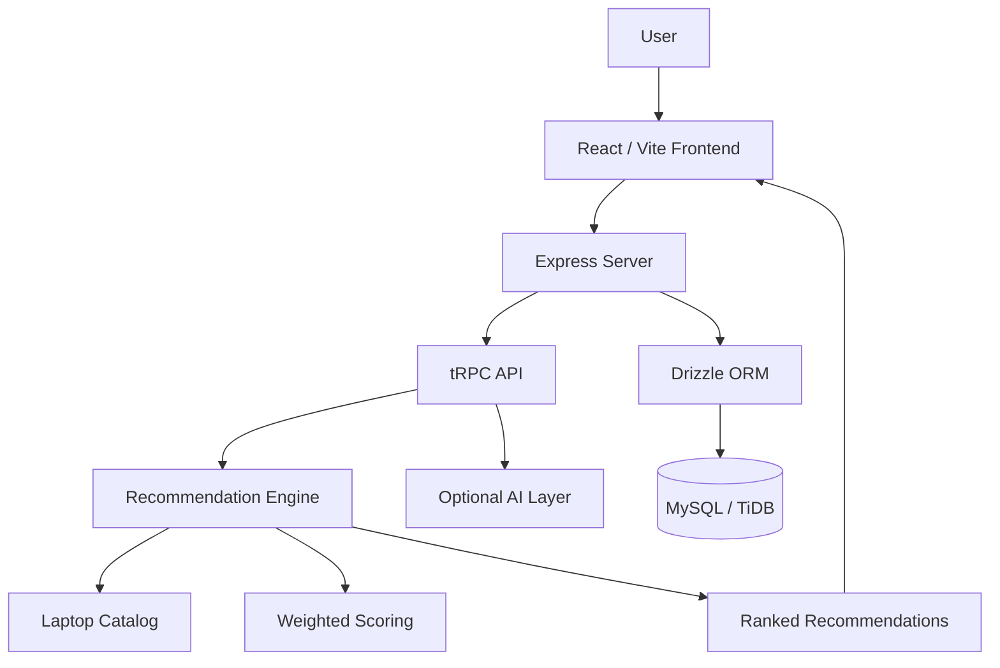

# 💻 LaptopAI

### AI-Powered Laptop Recommendation & Comparison Platform

<p align="center">

**🚀 Live Website:** https://laptopai.onrender.com/

**💻 Source Code:** https://github.com/Th3crazy-ally/laptopai

</p>

[](https://laptopai.onrender.com/)
[](https://github.com/Th3crazy-ally/laptopai)

> **Find the laptop that fits you — based on your budget, requirements, workload, and priorities.**

LaptopAI is a full-stack laptop recommendation and comparison platform that turns laptop specifications and user requirements into a clear, explainable shortlist.

---

## 🚀 Live Demo

### 👉 [Open LaptopAI](https://laptopai.onrender.com/)

Try the application directly:

**https://laptopai.onrender.com/**

### 💻 Source Code

**https://github.com/Th3crazy-ally/laptopai**

---

## ✨ Features

* 🎯 Personalized laptop recommendations
* 💰 Budget-based recommendations
* 🎮 Gaming-focused recommendations
* 👨‍💻 Programming and development recommendations
* 🎬 Content-creation recommendations
* 🤖 Optional AI-assisted recommendations
* 📊 Explainable recommendation scores
* ⚖️ Side-by-side laptop comparison
* 🔍 Laptop specification analysis
* 🧠 Natural-language requirement parsing
* 💡 AI-generated recommendation explanations
* 📱 Responsive interface
* 🌙 Light/dark theme support
* 🔄 Deterministic fallback when AI services are unavailable

---

## 🧠 How It Works

LaptopAI doesn't simply ask an LLM:

> "Which laptop should I buy?"

Instead, the application uses a structured recommendation pipeline:

```text
User Requirements
       │
       ▼
Requirement Processing
       │
       ▼
Laptop Catalog
       │
       ▼
Feature Extraction
       │
       ▼
Constraint Filtering
       │
       ▼
Weighted Recommendation Engine
       │
       ▼
Laptop Ranking
       │
       ▼
Top Recommendations
       │
       ▼
Optional AI Explanation
```

This makes the recommendation process more transparent and controllable.

---

## 📊 Recommendation Scoring

LaptopAI considers factors such as:

* CPU performance
* GPU performance
* RAM
* Storage
* Display
* Battery
* Portability
* Gaming suitability
* Programming suitability
* Value for money

User priorities dynamically influence the scoring weights.

A simplified model looks like:

```text
Overall Score =
    Performance × Performance Weight
  + Gaming × Gaming Weight
  + Programming × Programming Weight
  + Battery × Battery Weight
  + Portability × Portability Weight
  + Value × Value Weight
```

The final recommendation score is normalized to a 0–100 scale.

---

## 🎮 Gaming

LaptopAI can prioritize:

* GPU performance
* CPU performance
* RAM
* Display refresh rate
* Performance-to-price ratio

This makes it possible to find laptops suitable for different levels of gaming.

---

## 👨‍💻 Programming

For developers and students, LaptopAI can prioritize:

* CPU performance
* RAM
* SSD storage
* Multitasking capability
* Portability
* Battery life

---

## 🎬 Content Creation

For video editing and creative workloads, the system considers:

* CPU performance
* GPU performance
* RAM
* Storage
* Display
* Overall system performance

---

## 🤖 AI/ML

For AI/ML workloads, LaptopAI can prioritize:

* GPU capability
* VRAM
* CPU performance
* RAM
* Storage

---

## ⚖️ Laptop Comparison

Users can compare multiple laptops side-by-side.

Comparison categories include:

| Category          | Comparison |
| ----------------- | ---------- |
| Price             | ✅          |
| CPU               | ✅          |
| GPU               | ✅          |
| RAM               | ✅          |
| Storage           | ✅          |
| Display           | ✅          |
| Battery           | ✅          |
| Weight            | ✅          |
| Gaming Score      | ✅          |
| Programming Score | ✅          |
| Overall Score     | ✅          |

---

## 💡 AI Explanations

The optional AI layer can explain:

* Why a laptop was recommended
* Its strongest features
* Its weaknesses
* Important compromises
* Who should buy it
* Who should avoid it

The AI is designed to work from backend-supplied laptop information rather than inventing specifications.

If an AI service is unavailable, LaptopAI can fall back to deterministic explanations.

---

## 🏗️ Architecture



---

## 🛠️ Tech Stack

### Frontend

* React
* TypeScript
* Vite
* Tailwind CSS

### Backend

* Node.js
* Express
* TypeScript
* tRPC

### Database

* MySQL / TiDB
* Drizzle ORM

### AI

* Optional LLM integration
* Natural-language requirement parsing
* AI-assisted explanations
* Deterministic fallback system

### Testing

* Vitest
* TypeScript checking
* Production build validation

### Deployment

* GitHub
* Render

---

## 📁 Project Structure

```text
laptopai/
│
├── client/
│   ├── index.html
│   └── src/
│       ├── App.tsx
│       ├── pages/
│       ├── components/
│       └── index.css
│
├── server/
│   ├── catalog.ts
│   ├── recommendations.ts
│   ├── routers.ts
│   ├── db.ts
│   └── _core/
│
├── drizzle/
│   ├── schema.ts
│   └── migrations/
│
├── shared/
│   └── types.ts
│
├── docs/
│
├── .env.example
├── .gitignore
├── package.json
├── pnpm-lock.yaml
├── tsconfig.json
├── vite.config.ts
└── README.md
```

---

# ⚙️ Run Locally

## Prerequisites

* Node.js 22+
* pnpm 10+
* Git
* MySQL/TiDB-compatible database if database-backed functionality is required

### Clone the repository

```bash
git clone https://github.com/Th3crazy-ally/laptopai.git
cd laptopai
```

### Install dependencies

```bash
pnpm install
```

### Configure environment variables

```bash
cp .env.example .env
```

On Windows PowerShell:

```powershell
Copy-Item .env.example .env
```

Configure the required values inside `.env`.

### Start development server

```bash
pnpm dev
```

The application will normally be available at:

```text
http://localhost:3000
```

---

# 🧪 Testing

Run TypeScript checks:

```bash
pnpm check
```

Run tests:

```bash
pnpm test
```

Build for production:

```bash
pnpm build
```

Start production server:

```bash
pnpm start
```

---

# ☁️ Deployment

LaptopAI is deployed as a full-stack application on Render.

### Production URL

**https://laptopai.onrender.com/**

### Deployment architecture

```text
GitHub
   │
   ▼
Render Web Service
   │
   ├── React / Vite
   ├── Express
   ├── tRPC
   └── Recommendation Engine
```

### Build command

```bash
corepack enable && pnpm install --frozen-lockfile && pnpm build
```

### Start command

```bash
pnpm start
```

### Health check

```text
/
```

---

# 🔐 Environment Variables

Create a `.env` file locally using `.env.example`.

Example:

```env
DATABASE_URL=your_database_url
JWT_SECRET=your_secure_secret
NODE_ENV=development
```

Optional AI integration:

```env
OPENAI_API_KEY=your_api_key
```

**Never commit `.env` or real API credentials to GitHub.**

---

# 🛡️ Security

LaptopAI follows basic security practices including:

* Environment-based secrets
* `.gitignore` protection
* Input validation
* Server-side API credentials
* No committed production secrets
* Safe environment templates

If a credential is accidentally committed, rotate it immediately and remove it from the repository history.

---

# 📈 Project Status

| Component              | Status          |
| ---------------------- | --------------- |
| React frontend         | ✅ Complete      |
| Express backend        | ✅ Complete      |
| tRPC API               | ✅ Complete      |
| Laptop catalog         | ✅ Complete      |
| Recommendation engine  | ✅ Complete      |
| Laptop comparison      | ✅ Complete      |
| Explainable scoring    | ✅ Complete      |
| Deterministic fallback | ✅ Complete      |
| Automated tests        | ✅ Complete      |
| Production build       | ✅ Complete      |
| GitHub repository      | ✅ Public        |
| Render deployment      | ✅ Live          |
| Optional AI            | ⚙️ Configurable |
| Advanced ML            | 🚧 Planned      |

---

# 🗺️ Roadmap

### Phase 1 — Core Platform

* [x] Laptop catalog
* [x] Recommendation engine
* [x] Budget filtering
* [x] Use-case recommendations
* [x] Laptop comparison
* [x] Explainable scores
* [x] Responsive UI
* [x] Public deployment

### Phase 2 — AI

* [ ] Improved natural-language parsing
* [ ] Grounded AI explanations
* [ ] Review summarization
* [ ] Conversational laptop assistant

### Phase 3 — Machine Learning

* [ ] Larger real-world dataset
* [ ] Feature engineering pipeline
* [ ] ML recommendation model
* [ ] Recommendation evaluation
* [ ] User-feedback-based learning

### Phase 4 — Live Data

* [ ] Live laptop prices
* [ ] Price history
* [ ] Availability tracking
* [ ] Automated catalog updates
* [ ] Benchmark integration

### Phase 5 — Advanced Features

* [ ] User accounts
* [ ] Saved recommendations
* [ ] Recommendation history
* [ ] Price-drop alerts
* [ ] Personalized recommendations
* [ ] Review RAG
* [ ] Multiple currencies
* [ ] Affiliate integrations

---

# 🔮 Future Vision

LaptopAI is designed to evolve into a complete laptop decision platform.

The long-term architecture can combine:

```text
Laptop Specifications
        +
Benchmarks
        +
Prices
        +
Reviews
        +
User Requirements
        +
Historical Data
        +
Machine Learning
        +
Generative AI
        ↓
Personalized Recommendation
```

The goal isn't simply to find the laptop with the highest specifications.

The goal is to find the **best laptop for a particular person, budget, and workload.**

---

# 🤝 Contributing

Contributions are welcome.

### 1. Fork the repository

### 2. Create a feature branch

```bash
git checkout -b feature/my-feature
```

### 3. Make your changes

### 4. Run validation

```bash
pnpm check
pnpm test
pnpm build
```

### 5. Commit

```bash
git commit -m "Add my feature"
```

### 6. Push

```bash
git push origin feature/my-feature
```

### 7. Open a Pull Request

Please keep contributions focused and never commit secrets or generated dependencies.

---

# 📄 License

This project is licensed under the **MIT License**.

See the [`LICENSE`](LICENSE) file for details.

---

# 👨‍💻 Author

**Th3crazy-ally**

GitHub:
https://github.com/Th3crazy-ally

---

# ⭐ Try LaptopAI

## 🚀 [Open the Live Website →](https://laptopai.onrender.com/)

## 💻 [View the Source Code →](https://github.com/Th3crazy-ally/laptopai)

---

<p align="center">

**LaptopAI — Find the laptop that fits you.**

</p>
